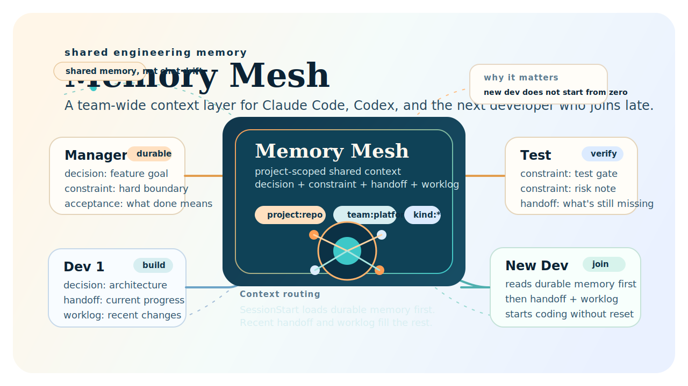

# Memory Mesh

[](https://github.com/baiyuqing/memory-mesh/actions/workflows/ci.yml)
[](LICENSE)
[](https://nodejs.org)
[](#)
[](#)



**Context relay for AI coding agents.** When an agent's context window fills up or a session ends, its discoveries evaporate. Memory Mesh preserves what matters — goals, decisions, constraints, handoffs — so the next agent picks up exactly where the last one left off.

Not team simulation. Not org-chart role-play. Just: **don't lose context between agents.**

## The Problem

[Anthropic's multi-agent research](https://www.anthropic.com/engineering/multi-agent-research-system) found that multi-agent systems perform poorly on tasks requiring shared context — especially coding. Every agent starts with a blank context window. The previous agent's findings, decisions, and gotchas are gone.

Memory Mesh is the external memory layer that makes multi-agent coding viable.

## How It Works

```
Agent A runs → context fills up → writes handoff to Memory Mesh → exits
                                                    ↓
Agent B starts → Memory Mesh injects lightweight refs → Agent B continues
                                                    ↓
                                        (uses get_memory for full details)
```

Session start injects compact references (~500 tokens, not full summaries):

```
Persistent memory for myproject

Goals & durable memory:
  📌 [goal] by agent-a: Ship v2 API — Full backward compat by end of Q3 — ID: goal-1
  📌 [decision] by agent-a: Use PostgreSQL — Chose PG over DynamoDB for join support — ID: decision-1

Recent activity:
  🔄 [handoff] by agent-a: DB migration done — user_id needs string↔UUID adapter, see adapters/uid.mjs — ID: handoff-1

Use `get_memory` with any ID above for full details, or `search_memories` to find more.
```

The agent knows what to do. It doesn't need to ask.

## Install

```text
/install baiyuqing/memory-mesh
```

Restart Claude Code after installation.

## Memory Types

| Type | Category | Purpose |
|------|----------|---------|
| `goal` | Durable | What we're trying to achieve |
| `decision` | Durable | Why we chose this approach |
| `constraint` | Durable | What we must not break |
| `handoff` | Activity | Where the last agent left off |
| `session-summary` | Activity | Auto-generated session recap |
| `worklog` | Activity | Incremental progress notes |

Context injection selects up to 3 durable (goals first) + 2 activity from the 20 most recent.

## Backends

### Local (default)

```text
MEMORY_MESH_BACKEND=local
```

Storage at `~/.memory-mesh/sessions/` and `~/.memory-mesh/memories/`. Override with `MEMORY_MESH_HOME`.

### mem9 (shared)

For multiple agents sharing context across machines.

```json
{
  "env": {
    "MEMORY_MESH_BACKEND": "mem9",
    "MEM9_API_URL": "https://api.mem9.ai",
    "MEM9_API_KEY": "your-api-key",
    "MEMORY_MESH_AGENT_ID": "claude-code"
  }
}
```

### Dual-Write Storage

When `backend=mem9`, writes go to **both** local and mem9:

- **Local** preserves verbatim content (source of truth, no compression)
- **mem9** enables cross-agent sharing (may compress/deduplicate)
- **Reads** merge both sources, local wins on duplicates
- **Failure tolerant** — if mem9 is down, local still works

## Hook Lifecycle

| Hook | What it does |
|------|-------------|
| `SessionStart` | Injects lightweight memory references into context |
| `UserPromptSubmit` | Records prompt to local session journal |
| `PostToolUse` | Records tool activity, changed files, commands |
| `Stop` | Compacts session into a reusable memory snapshot |

Memory is grouped by project using Git metadata. Worktrees from the same repo share the same project key.

## MCP Tools

| Tool | Purpose |
|------|---------|
| `get_memory` | Fetch full memory by ID (on-demand detail retrieval) |
| `search_memories` | Full-text search across memories |
| `list_recent_memories` | Browse recent memories |
| `store_memory` | Persist an explicit memory |
| `remember_goal` | Store a goal |
| `remember_decision` | Store a decision |
| `remember_constraint` | Store a constraint |
| `remember_handoff` | Store a handoff note |

## Claude Code + Codex

- Claude Code uses hooks for auto-load and auto-store
- Codex uses the MCP server at [`plugin/scripts/mcp-server.mjs`](./plugin/scripts/mcp-server.mjs)
- Both use the same `MEM9_API_KEY`, distinguished by `MEMORY_MESH_AGENT_ID`

## Development

```bash
npm test
npm run demo:team-memory
```

The plugin lives in [`plugin/`](./plugin). Marketplace manifest at [`.claude-plugin/marketplace.json`](./.claude-plugin/marketplace.json).
