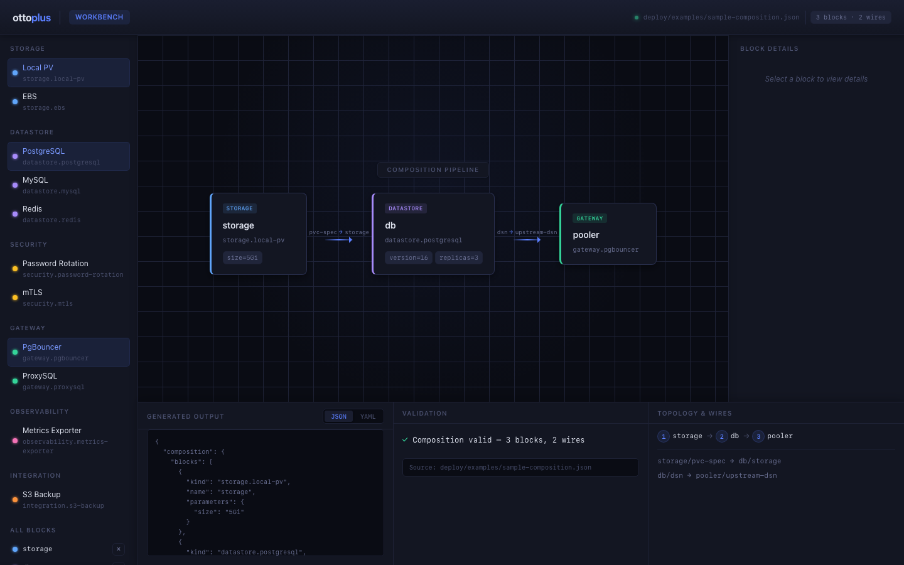
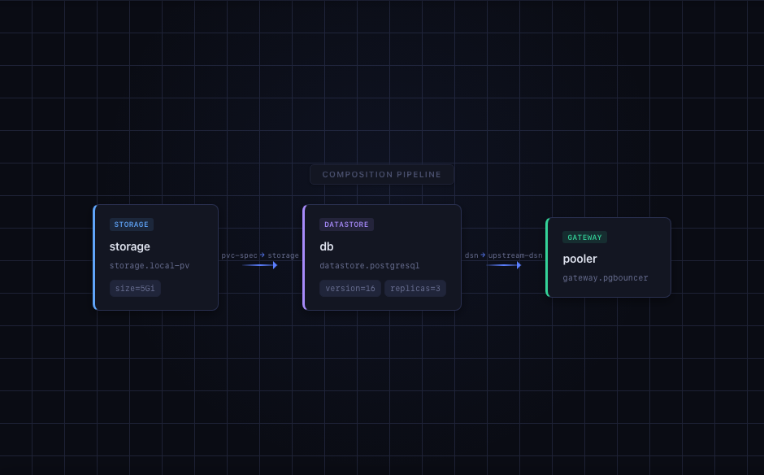

# ottoplus

A composable local infrastructure workbench for AI agents. Define your stack as blocks, wire them together, and see the result instantly — no hand-stitching YAML, no guessing dependency order.



## What You Can Do Today

- **Workbench** — open the browser, see the 3-block onboarding path, edit parameters, delete/restore blocks, and watch generated output, validation, and topology update in real time.
- **API** — `POST` a composition JSON to get validation, auto-wiring, and topological ordering via the REST API on `:8080`.
- **CLI** — run `ottoplus compose validate`, `auto-wire`, or `topology` against any composition file from the terminal.

## Start Here

### Workbench + API (recommended)

```bash
make workbench
```

Starts both the API server (`:8080`) and the browser workbench (`:5173`) in one command. Open [http://localhost:5173](http://localhost:5173). All credential-source surfaces are available by default.

### Browser only (frontend-only, no API)

```bash
cd web && npm install && npm start
```

Open [http://localhost:5173](http://localhost:5173). The workbench loads the onboarding sample but credential-source badges show as unavailable without the API.

### API server only

```bash
make demo
```

Starts the API on `:8080`. Verify with:

```bash
curl -s http://localhost:8080/healthz | jq .
curl -s -X POST http://localhost:8080/v1/compositions/validate \
  -H 'Content-Type: application/json' \
  -d @deploy/examples/sample-composition.json | jq .
```

### CLI

```bash
go run ./cmd/ottoplus --help
go run ./cmd/ottoplus blocks list
go run ./cmd/ottoplus compose validate --file deploy/examples/sample-composition.json
go run ./cmd/ottoplus compose auto-wire --file deploy/examples/sample-composition.json
go run ./cmd/ottoplus compose topology --file deploy/examples/sample-composition.json
```

All commands support `--format json` for machine-readable output:

```bash
go run ./cmd/ottoplus blocks list --format json
go run ./cmd/ottoplus compose validate --file deploy/examples/sample-composition.json --format json
go run ./cmd/ottoplus compose auto-wire --file deploy/examples/sample-composition.json --format json
go run ./cmd/ottoplus compose topology --file deploy/examples/sample-composition.json --format json
```

The CLI accepts any composition JSON via `--file`. Run any command with `--help` for usage details.

## Onboarding Sample

The default composition lives at `deploy/examples/sample-composition.json` and wires three blocks:

```
local-pv  →  postgresql  →  pgbouncer
(storage)    (db)            (pooler)
```



The workbench imports this file directly and loads it on startup. The CLI and API examples in this README use it as a demo input, but they accept any composition file — they are not bound to this one. A 4-block standard path (`+ password-rotation`) is available at `deploy/examples/standard-composition.json` for CI and regression tests.

### Credential sources

The two example compositions differ in how the pooler gets its upstream credential:

| Path | Composition | Credential source |
|------|-------------|-------------------|
| Sample (3-block) | `sample-composition.json` | `pooler <- db` — the pooler has no explicit `upstream-credential` input, so the compiler auto-wires it from `db`'s `credential` output |
| Standard (4-block) | `standard-composition.json` | `pooler <- rotator` — the pooler's `upstream-credential` input is explicitly wired to `rotator/credential` |

This difference is visible across all surfaces: CLI (`compose topology`), API (`POST /v1/compositions/topology` → `credentialSources`), and the workbench topology panel.

## How It Is Structured

```
      ┌──────────┐  ┌──────────┐  ┌─────┐  ┌──────────────┐
      │Workbench │  │ REST API │  │ CLI │  │   Operator    │
      │ (browser)│  │  :8080   │  │     │  │  (k8s CRDs)  │
      └────┬─────┘  └────┬─────┘  └──┬──┘  └──────┬───────┘
           │              │           │            │
           │              └─────┬─────┘            │
           │                    └────────┬─────────┘
           │                             ▼
           │                   ┌──────────────────┐
           │                   │ Shared Compiler   │
           │                   │ + Block Registry  │
           │                   │ (validate, wire,  │
           │                   │  topo-sort)       │
           │                   └──────────────────┘
           │
           ▼
  sample-composition.json
  (default demo input)
```

- **Workbench** (`web/`) — Vite + React + TypeScript browser UI. Imports `sample-composition.json` directly at build time as the default demo input.
- **API** (`cmd/api`) — REST endpoints for block catalog, validation, auto-wiring, and topology. Accepts any composition JSON via POST.
- **CLI** (`cmd/ottoplus`) — Terminal interface for listing blocks and running compose commands (`validate`, `auto-wire`, `topology`) against any composition file.
- **Operator** (`cmd/operator`) — Kubernetes controller that watches `Cluster` CRDs and reconciles blocks in dependency order.
- **Shared Compiler + Block Registry** (`src/core/`) — pure Go logic used by API, operator, and CLI. Single path for shorthand expansion, explicit wiring, and compilation.

## Developer Links

| Resource | Path |
|----------|------|
| Workbench quickstart | [`web/QUICKSTART.md`](web/QUICKSTART.md) |
| Workbench developer guide | [`web/DEVELOPER.md`](web/DEVELOPER.md) |
| Sample composition (3-block) | [`deploy/examples/sample-composition.json`](deploy/examples/sample-composition.json) |
| Standard composition (4-block) | [`deploy/examples/standard-composition.json`](deploy/examples/standard-composition.json) |
| CRD definition | [`deploy/crds/`](deploy/crds/) |

```bash
make help          # Show all targets
make workbench     # Start API + workbench together (recommended)
make build         # Build api-server and operator binaries
make test          # Unit tests
make demo          # Build and run API server locally
make ci-local      # All CI checks (Go smoke + unit + web)
make dev-up        # Create k3d cluster + LocalStack
make dev-down      # Tear down
```

## License

MIT
